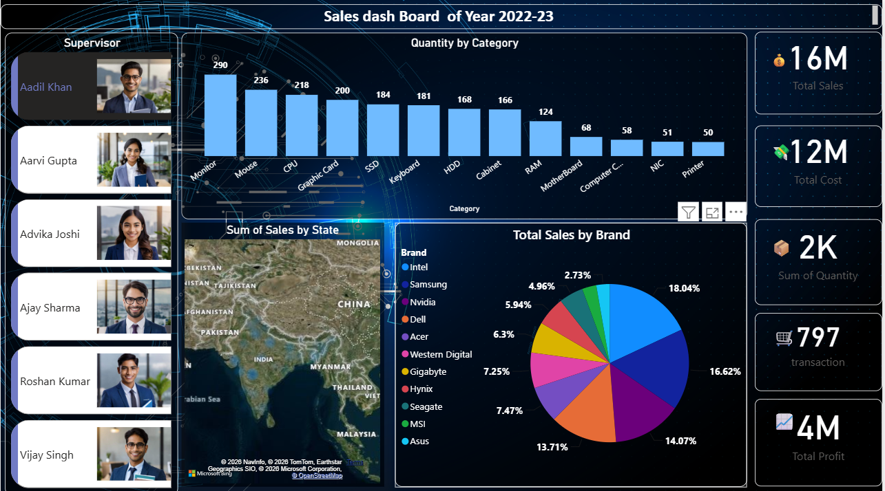

Sales Power BI Dashboard
=========================

An interactive sales dashboard developed using Microsoft Power BI to analyze sales performance, identify trends, and present meaningful business insights through data visualization.

Dashboard Preview

Project Overview

This project focuses on transforming raw sales data into an interactive Power BI dashboard. The dashboard provides a clear and structured view of sales performance and helps in understanding product-level and overall sales trends.

Features

- Interactive sales visualizations
- KPI-based sales analysis
- Product-wise performance analysis
- Sales trend analysis
- Interactive filters and dashboard navigation
- Clean and user-friendly dashboard design

Tools & Technologies

- Microsoft Power BI
- Microsoft Excel
- CSV Dataset
- Data Visualization
- Data Analysis

Project Files

| File | Description |
|------|-------------|
| `Sales_Dashboard.pbix` | Power BI dashboard file |
| `Sales_Data.csv` | Dataset used for the analysis |
| `dashboard-preview.png` | Dashboard preview image |
| `dashboard-background.png` | Dashboard background |

Skills Applied

Data Analysis • Data Visualization • Microsoft Excel • Power BI • Dashboard Design

Getting Started

To explore the dashboard:

1. Download `Sales_Dashboard.pbix`.
2. Open the file using Microsoft Power BI Desktop.
3. If required, update the data source to `Sales_Data.csv`.
4. Use the available filters and visualizations to explore the sales data.

Project Information

**Project:** Sales Power BI Dashboard  
**Category:** Data Analytics & Business Intelligence  
**Tool:** Microsoft Power BI

 🚀 How to Use

1. Download or clone this repository.
2. Open `Sales_Dashboard.pbix` using Microsoft Power BI Desktop.
3. If required, update the dataset connection to `Sales_Data.csv`.
4. Use the interactive filters and visuals to explore the dashboard.

## 📷 Dashboard Preview

The dashboard provides an interactive view of sales performance and business insights.
---

### 👨‍💻 Project

**Sales Power BI Dashboard**

Built as a data analytics and business intelligence project using Microsoft Power BI.
